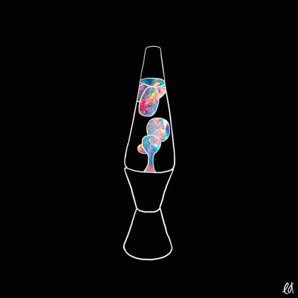

# LAMP full-stack application



Full-stack application using HTML, CSS, JS, PHP and mySQL. Application supports a login page and a user portal, where authenticated users can search for contacts in their remote contacts list. Contacts can be **C**reated, **R**ead, **U**pdated, and **D**eleted.

## Motivation

Created to satisfy the 'Small Project' group assignment for Prof. Rick Leinecker's COP4331 Processes of Object-Oriented Software during the Spring 2022 semester.

## Technical Requirements
Remote hosting is handled by [Digital Ocean](https://www.digitalocean.com/), where a single 'droplet' (Digital Ocean's smallest server-hosting size) was spun up with a [one-click LAMP stack](https://marketplace.digitalocean.com/apps/lamp).

The LAMP stack is composed of:
### **L**inux
The open-source operating system used on the remote server
### **A**pache
The open-source Web server used for hosting the remote content
### **M**ySql
The open-source RDBMS<sup>1</sup> used for processing the data in the database
### **P**HP
The open-source, server-sided scripting language used for processing backend computations

## Repository overview
```
├── README.md
└── src
    ├── index.html
    ├── styles
    ├── js    
    └── media
        ├── images
        └── gifs
```

## API Documentation

API endpoints are documented at [SwaggerHub](https://app.swaggerhub.com/apis/COP4331_group23/COP4331_group23/1.0.0).

## Running instructions

Visit [Collective Contacts](http://collectivecontacts.xyz) to log in.

Log in and, upon authentication, perform any of the following operations on the user's contact list:
- Create (add contact),
- Read (search contact list),
- Update (update contact information), and 
- Delete (delete contact from list)


## Contributors

Project Manager/Frontend: [Tam Nguyen](https://github.com/kaiyom90)

Frontend: [Justice Smith](https://github.com/jcode94)

API: [Kevin Cahalan](https://github.com/kevinacahalan) and [Kevin Jimenez](https://github.com/KevinJ0226)

Database: [Kelvin Florenciani](https://github.com/Sagerushboy)


<sup>1</sup>: Relational Database Management System

